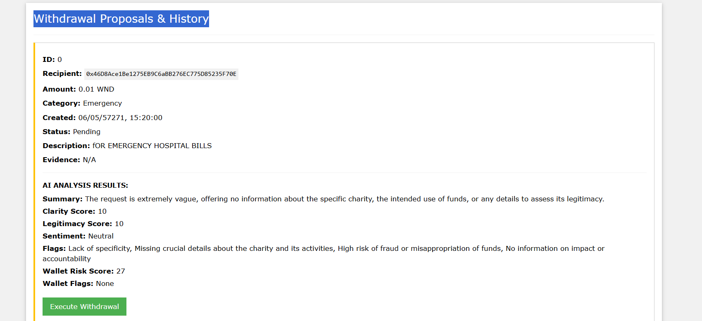

# NexusGiving - Transparent & Efficient Treasury Management

[](https://opensource.org/licenses/MIT)
<!-- Add other badges if applicable: Build Status, Coverage, etc. -->
<!-- e.g., [](https://travis-ci.org/your-username/nexus-giving) -->

**A secure and gas-optimized smart contract system for managing donations and owner-controlled proposal-based withdrawals, designed with transparency and efficiency in mind.**

**https://www.loom.com/share/8e0799b5d6c5494385247c153c1b34d6?sid=dd3f8c07-4fe6-4ae1-b716-f75473374c5f**

---

## Table of Contents

*   [About The Project](#about-the-project)
    *   [Problem](#problem)
    *   [Solution](#solution)
    *   [Key Features](#key-features)
*   [Technology Stack](#technology-stack)
*   [Getting Started](#getting-started)
    *   [Prerequisites](#prerequisites)
    *   [Installation](#installation)
*   [Usage / Workflow](#usage--workflow)
    *   [1. Donating Funds](#1-donating-funds)
    *   [2. Proposing a Withdrawal (Owner)](#2-proposing-a-withdrawal-owner)
    *   [3. Executing a Withdrawal (Owner)](#3-executing-a-withdrawal-owner)
    *   [4. Viewing Information](#4-viewing-information)
*   [Smart Contract Details](#smart-contract-details)
    *   [Core Contract: `NexusGiving.sol`](#core-contract-nexusgivingsol)
    *   [Gas Optimization: Event-Based Metadata](#gas-optimization-event-based-metadata)
    *   [Security Considerations](#security-considerations)
    *   [Custom Errors](#custom-errors)
*   [Addressing Evaluation Criteria](#addressing-evaluation-criteria)
    *   [Innovation and Originality](#innovation-and-originality)
    *   [Usability and Design](#usability-and-design)
    *   [Impact Potential](#impact-potential)
    *   [Feasibility](#feasibility)
    *   [Use of the Blockchain (Polkadot Asset Hub Context)](#use-of-the-blockchain-polkadot-asset-hub-context)
    *   [Technical Implementation (Point 7 Focus)](#technical-implementation-point-7-focus)
*   [Deployment](#deployment)
*   [Running Tests](#running-tests)
*   [Contributing](#contributing)
*   [License](#license)
*   [Contact](#contact)
*   [Acknowledgements](#acknowledgements)

---

## About The Project

NexusGiving provides a robust framework for organizations, DAOs, or community funds needing a transparent and secure way to handle donations and manage expenditures on the blockchain. It prioritizes efficiency and auditability through a clear proposal system and smart use of blockchain events.

### Problem

Managing shared funds or donations often involves challenges with transparency, accountability, and operational costs. Traditional methods can be opaque, and storing extensive descriptive data directly on-chain for every transaction can become prohibitively expensive.

### Solution

NexusGiving tackles this with a smart contract deployed on **[Remix IDE , e.g., Polkadot Asset Hub / Rococo Asset Hub / EVM Parachain]**.

1.  **Secure Treasury:** Funds are held securely within the smart contract.
2.  **Transparent Ledger:** All donations and executed withdrawals are publicly verifiable via blockchain events.
3.  **Controlled Spending:** An `Owner` role manages withdrawals through a mandatory two-step process (propose, then execute).
4.  **Cost Efficiency:** **Crucially**, descriptive metadata (like proposal descriptions and evidence links) is *not* stored in contract state. Instead, it's emitted in events (`ProposalCreated`), significantly reducing gas costs associated with proposal creation while ensuring data availability off-chain.

### Key Features

*   ✅ **Direct Donations:** Accept native token donations (e.g., ETH, DOT) via simple transfers.
*   ✅ **Owner-Controlled:** Uses OpenZeppelin's `Ownable` for clear access control over sensitive functions.
*   ✅ **Proposal System:** Structured approach (`Proposal` struct) for initiating withdrawals (recipient, amount, category).
*   ✅ **Two-Step Execution:** Proposals must be explicitly executed by the owner after creation.
*   ✅ **Reentrancy Protection:** Incorporates OpenZeppelin's `ReentrancyGuard` on the withdrawal function.
*   ✅ **Gas Optimization:** Leverages events (`ProposalCreated`) to store descriptive strings off-chain, saving significant storage costs.
*   ✅ **Custom Errors:** Utilizes custom errors for more gas-efficient reverts and clearer debugging.
*   ✅ **Event Emission:** Rich events (`DonationReceived`, `ProposalCreated`, `ProposalExecuted`) for easy off-chain monitoring and UI integration.

---

## Technology Stack

*   **Smart Contracts:** Solidity `^0.8.20`
*   **Libraries:** OpenZeppelin Contracts (`Ownable`, `ReentrancyGuard`)
*   **Development Framework:** [e.g., Hardhat / Foundry / Truffle]
*   **Testing:** [e.g., Chai, Mocha / Forge Std]
*   **Frontend (Optional):** [e.g., React, Vite, Ethers.js / Polkadot.js]
*   **Target Blockchain:** [e.g., Polkadot Asset Hub (via ink!/Solang adaptation?), Moonbeam, Astar, Local Testnet]

**Note for Polkadot Asset Hub:** While this base contract is Solidity, for native Asset Hub deployment, it would typically be rewritten in **ink!** or compiled using **Solang**. Please refer to the `[contracts/ink]` or `[contracts/solang]` directory if applicable for the Asset Hub specific version. This README primarily describes the Solidity logic.

---

## Getting Started

To get a local copy up and running follow these simple steps.

### Prerequisites

*   Node.js (v16 or later recommended)
*   NPM or Yarn
*   Git
*   [Add other specific prerequisites like Foundry if using it]

### Installation

1.  **Clone the repo:**
    ```bash
    git clone [Your Repository URL]
    cd nexus-giving
    ```
2.  **Install NPM packages:**
    ```bash
    npm install
    # or
    yarn install
    ```
---3. install ethers 
4 go to remix ide
5. paste the solidity contract i have given in the contracts floder in it and then complie copy the ABI for future refernces 
6. go to depoly and run transcation in the nevirnoment injecyt meta mask provider and select your account 
7. depoly the contract and after that down you will be seeing the deployed contract there u will find the contract address copy for future references 
8. now paste the contract address and ABI in the app.js file 
after thats it envirnomnet is set up 
9. open terminal where you cloned the file and then run 'npmn start ' command to start the node js 

10. now the browerser will be openned and you will find the connect button press it metamask will popo for verification veryfy it and 
11. after verifying you raddress there you will 

12. here you can see my account addressa and owner account address is same because because i created it 
13.now enter the amount donate IF YOU FEEL YOUR LIKE STUCK AND THE PAYMENT IS PAUSED GO TO METAMASK OPEN AND SPEED UP THE TRANSCARTION
14. it if anyone proposed for withdrawal you will able to see the transcation history  #
 WE ARE USING HERE WESTEND ASSET HUB PERFERRED BBY POLKADOT ASSET HUB FOR TESTING

## Usage / Workflow

Interaction with the contract follows these main steps:

### 1. Donating Funds

Anyone can donate the native currency (e.g., ETH, DOT) by sending it directly to the deployed `NexusGiving` contract address.

*   **Method:** Standard wallet transfer to the contract address.
*   **Event:** Emits `DonationReceived(donor, amount)`.

### 2. Proposing a Withdrawal (Owner)

Only the contract owner can propose a withdrawal.
1. the process of withdrawing only admin will fond the access to withdraw and they have to submit and evidance descriptiona n 
2. AFTER PROCESING THE WITHDRAWAL ALL THE REMAING ADMIN WILL ABLE TO SEE IF THE EDVICE IS GUINE OR NOT BY AI INTEGRATED USING api INIT 
3. |if your not finding the answer from ai boot it is opensoucre it is not good 'curl -X POST http://localhost:5001/finalize-analysis/PROPOSALID -H "Content-Type: application/json" -d "{\"recipientAddress\": \"0x46D8Ace1Be1275EB9C6aBB276EC775D85235F70E\", \"description\": \"Donating to charity\", \"evidenceCID\": \"\"}"
'
4. THENN YOU CAN FIND THE ID from the Withdrawal Proposals & History use the this command paste the id you will ge the ai answer 
eg as you ca see here 

then if u feel ok excute it 


*   **Method:** Call the `proposeWithdrawal` function with:
    *   `_recipient` (address payable): The address to send funds to.
    *   `_amount` (uint256): The amount (in Wei) to withdraw.
    *   `_category` (enum Category): The purpose (e.g., `Salaries`, `Logistics`).
    *   `_description` (string): A detailed description of the withdrawal.
    *   `_evidenceLink` (string): A URL or identifier linking to supporting evidence.
*   **Action:** Creates a new `Proposal` entry in the contract's internal array.
*   **Event:** Emits `ProposalCreated(proposalId, recipient, amount, category, description, evidenceLink)`. Note that `description` and `evidenceLink` are ONLY in the event, not stored on-chain.

